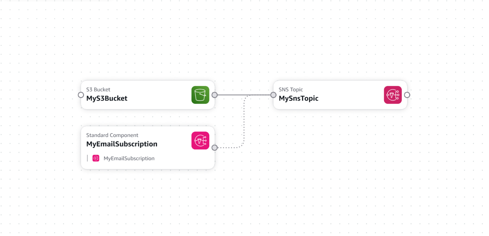

# S3 → SNS Email Notification Stack

Uploads to an S3 bucket trigger an email notification via SNS.
Deployed using AWS CloudFormation — infrastructure defined as code, no console clicking.

## Architecture



## Resources Created

| Resource | Type | Purpose |
|---|---|---|
| MyS3Bucket | AWS::S3::Bucket | Receives file uploads |
| MySnsTopic | AWS::SNS::Topic | Notification channel |
| MyEmailSubscription | AWS::SNS::Subscription | Delivers to email |
| MySnsTopicPolicy | AWS::SNS::TopicPolicy | Grants S3 permission to publish |

## Deploy

```powershell
.\scripts\deploy.ps1 -StackName "s3-sns-email" -TemplatePath ".\01_Basic_CF_yaml_projects\template.yaml" -Email "you@email.com"
```

## Test

```powershell
aws s3 cp anyfile.txt s3://dev-uploads-YOURACCOUNTID/
```

## Delete

```powershell
.\scripts\delete.ps1 -StackName "s3-sns-email"
```

## Key Concepts

**Declarative infrastructure** — YAML describes what should exist, CloudFormation figures out build order automatically.

**Dependency ordering** — SNS policy created before S3 bucket via `DependsOn`.

**IAM permissions** — AWS denies everything by default. SNS Topic Policy explicitly grants S3 permission to publish.

**Parameters** — email and environment passed at deploy time, never hardcoded in the file.