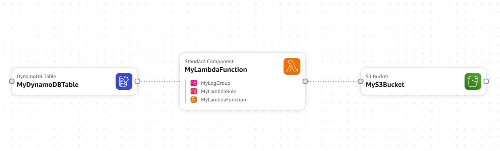

# S3 → Lambda → DynamoDB Pipeline

CSV files uploaded to S3 trigger a Lambda function that parses each row and writes it to DynamoDB.
Deployed using AWS CloudFormation — infrastructure defined as code

## Architecture



## Resources Created

| Resource | Type | Purpose |
|---|---|---|
| MyS3Bucket | AWS::S3::Bucket | Receives CSV uploads, fires trigger |
| MyLambdaFunction | AWS::Lambda::Function | Parses CSV and writes rows to DynamoDB |
| MyLambdaRole | AWS::IAM::Role | Grants Lambda permission to read S3, write DynamoDB, log to CloudWatch |
| MyLambdaPermission | AWS::Lambda::Permission | Allows S3 to invoke Lambda |
| MyDynamoDBTable | AWS::DynamoDB::Table | Stores parsed CSV rows |
| MyLogGroup | AWS::Logs::LogGroup | Captures Lambda execution logs |

## Deploy

```powershell
.\scripts\deploy.ps1 -StackName "s3-lambda-dynamo" -TemplatePath ".\02_S3_Lambda_DynamoDB\template.yaml"
```

## Test

Upload a CSV file to the bucket:

```powershell
aws s3 cp test.csv s3://dev-csv-uploads-YOURACCOUNTID/
```

Then check DynamoDB to verify rows were written:

```powershell
aws dynamodb scan --table-name dev-csv-data
```

## Delete

```powershell
.\scripts\delete.ps1 -StackName "s3-lambda-dynamo"
```

Empty the bucket first if you uploaded any test files:

```powershell
aws s3 rm s3://dev-csv-uploads-YOURACCOUNTID --recursive
```

## Key Concepts

**Two-sided service connections** — S3 directs notifications via `NotificationConfiguration`. Lambda accepts them via `AWS::Lambda::Permission`. Both sides must agree or the trigger silently fails.

**IAM trust policy vs permission policy** — the role's trust policy says who can wear the role (`lambda.amazonaws.com`). The permission policy says what they can do (`s3:GetObject`, `dynamodb:PutItem`, `logs:*`). Two separate concepts inside one role resource.

**CAPABILITY_NAMED_IAM** — required when IAM resources have explicit names. CloudFormation treats predictable role names as higher risk and requires acknowledgement.

**DependsOn vs !Ref** — `!Ref` and `!GetAtt` create implicit ordering automatically. `DependsOn` is only needed when two resources have no reference between them but order still matters — S3 bucket must wait for Lambda Permission to exist before AWS validates the notification wiring.

**Environment variables** — DynamoDB table name passed to Lambda at runtime via `Environment.Variables`, not hardcoded in the function code. Keeps infrastructure and application config separated.